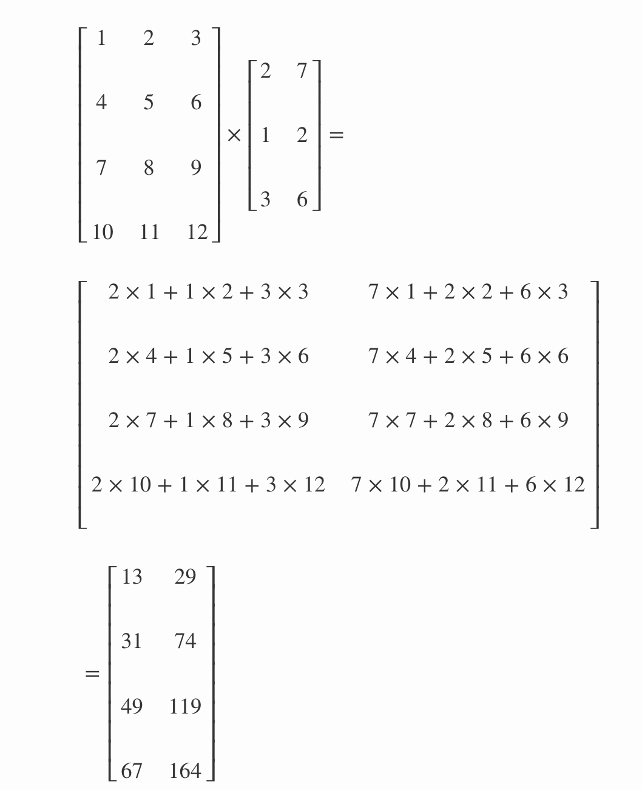

# Matrix Multiplication - Code Along

## Introduction
Understanding matrix operation is very important for a deeper understanding of linear algebra. We know matrices are used throughout the field of machine learning in the description of algorithms and representation of data. In this lesson, we shall discover how to manipulate matrices in Python and Numpy.

## Objectives

You will be able to:

* Perform element-wise matrix multiplication known as Hadamard product.
* Understand assumptions and take a dot product between matrices and vectors. 
* Understand cross product between two vectors in the vector space. 

## Definition
Multiplication of two matrices is one of the most crucial operations involving matrices. We can write the matrix product just by placing two or more matrices together, for example, 

> **C = AB** 

The standard product of two matrices is not just a matrix containing element-wise product of the individual elements. Such an operation exists and is called the element-wise product, or **Hadamard product**

## Hadamard Product

Two matrices with the same dimensions can be multiplied together. Such element-wise matrix multiplication is called the Hadamard product. It is not the typical operation meant when referring to matrix multiplication, therefore a different operator is often used, such as a circle “o”. 
> **C = A o B**

As with element-wise addition and subtraction, element-wise multiplication involves the multiplication of elements from each parent matrix to calculate the values in the new matrix as shown below.

```
         a11 * b11, a12 * b12
A o B = (a21 * b21, a22 * b22)
         a31 * b31, a32 * b32
```
Hadamard product can be calculated in python using the  (\*) operator between two NumPy arrays.

```python
# Element-wise Hadamard Product
import numpy as np
A = np.array([[1, 2, 3], [4, 5, 6]])
print(A)
B = np.array([[1, 2, 3], [4, 5, 6]])
print(B)
print ('\nHadamard Product\n\n', A * B)
```


```python
# Code here
```

## Dot Product

We can calculate dot-products to check the similarity between matrices. The matrix dot product is more complicated than the previous operations and involves a rule as **not all matrices can be dot multiplied together**.The rule is as follows:

The matrix product of matrices A and B is a another matrix C. For defining this product, A must have the same number of dimensions as B has rows. 

> **The number of columns in the first matrix must equal the number of rows in the second matrix **

For example, think of a matrix A having m rows and n columns and matrix B having n rows and and k columns. Provided the n columns in A and n rows b are equal, the result is a new matrix with m rows and k columns. A dot product can be shown using (.) or (dot). 

> **C<sub>(m,k)</sub> = A<sub>(m,n)</sub> dot B<sub>(n,k)</sub>**

OR 

> **C<sub>(m,k)</sub> = A<sub>(m,n)</sub> . B<sub>(n,k)</sub>**

The product operation is defined by


The calculations are performed as shown below:
```
     a11, a12
A = (a21, a22)
     a31, a32

     b11, b12
B = (b21, b22)

     a11 * b11 + a12 * b21, a11 * b12 + a12 * b22
C = (a21 * b11 + a22 * b21, a21 * b12 + a22 * b22)
     a31 * b11 + a32 * b21, a31 * b12 + a32 * b22
```
This rule applies for a chain of matrix multiplications.  The number of columns in one matrix in the chain must match the number of rows in the following matrix in the chain. The intuition for the matrix multiplication is that we are calculating the dot product between each row in matrix A with each column in matrix B. For example, we can step down rows of column A and multiply each with column 1 in B to give the scalar values in column 1 of C.

This is made clear with the following worked example between two matrices.


Let's define above matrices and see how to achieve this in python and numpy with `.dot()` :

```python
# matrix dot product
A = np.array([[1, 2, 3], [4, 5, 6], [7, 8, 9], [10, 11, 12]])
B = np.array([[2, 7], [1, 2], [3, 6]])

C = A.dot(B)

print(A, '\ndot', '\n', B, '\n=\n', C)
```


```python
# Code here 
```

## Matrix-Vector Dot Product

A matrix and a vector can be multiplied together as long as the rule of matrix multiplication (stated above) is observed. The number of columns in the matrix must equal the number of rows in the vector. As with matrix multiplication, the operation can be written using the dot notation. Because the vector only has one column, the result is always a vector. See the general approach below where A is the matrix being multiplied to v, a vector
```
     a11, a12
A = (a21, a22)
     a31, a32

     v1
v = (v2)

     a11 * v1 + a12 * v2
c = (a21 * v1 + a22 * v2)
     a31 * v1 + a32 * v2
```
The matrix-vector multiplication can be implemented in NumPy using the dot() function as seen before.

```python
# matrix-vector multiplication

A = np.array([[1, 2], [3, 4], [5, 6]])
v = np.array([0.5, 0.5])

C = A.dot(v)

print(A,'\ndot', '\n',v,'\n=',C)
```


```python
# Code here 
```

## Cross Product

We know from basic geometry that a vector has magnitude (how long it is) and direction. Two vectors can be multiplied using the "Cross Product". The cross product or vector product is a binary operation on two vectors in three-dimensional space. The result is a vector which is perpendicular to the vectors being multiplied and normal to the plane containing them. 


The cross product of two vectors a and b is denoted by a × b. 

It's defined as: 
> **a × b = |a| |b| sin(θ) n**

* |a| is the magnitude (length) of vector a
* |b| is the magnitude (length) of vector b
* θ is the angle between a and b
* n is the unit vector at right angles to both a and b

If either of the vectors being multiplied is zero or the vectors are parallel then their cross product is zero. More generally, the magnitude of the product equals the area of a parallelogram with the vectors as sides. If the vectors are perpendicular the parallelogram is a rectangle and the magnitude of the product is the product of their lengths. 

In Numpy we can take a cross product with `.cross()` function
```python
# Cross product between two vectors
x = np.array([0,0,1])
y = np.array([0,1,0])

print(np.cross(x,y))
print(np.cross(y,x))
```


```python
# Code here 
```

Interesting, we shall look at the applications of cross product later while trying to learn new machine learning algorithms and developing geometric intuitions. Natural Language Processing and bringing in text into vector space to check for say document similarity, is a popular area where cross products and other similar measures are used for analysis. For now we shall look a bit more into the dot product.

#### Similar to scalar-vector multiplication, a scalar-matrix multiplication involves multiplying every element of the matrix to the scalar value, resulting as an output matrix having same dimensions as the input matrix.

## Summary 

In this lesson, we looked at matrix multiplication using Hadamard product and dot product. We also looked at how to take the dot product between vectors and matrices while observing the size assumptions. We also saw how cross product works between two vectors. Next , we shall look at some properties of dot products and what makes them so special. 

