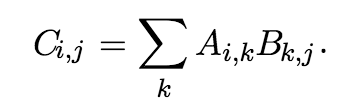

# Pure Python vs. Numpy - Lab

## Introduction 

Numpy, Scipy and Pandas libraries provide a significant increase in computational efficiency with complex mathematical operations as compared to Python's built in arithmatic functions.  In this lab we shall calculate and compare the processing speed required for calculating a dot product both using basic arithmatic operations in Python and Numpy's `.dot()` method. 

## Objectives
You will be able to:
* Compare the performance of high dimensional matrix operations in Numpy vs. pure Python

## Problem
> **Write a routine to calculate the dot product between two 200 x 200 dimensional matrices using:**

> **a) Pure Python**

> **b) Numpy's `.dot()`**


### Create two 200 x 200 matrices in Python and fill them with random values using `np.random.rand()` 


```python
# Compare 200x200 matrix-matrix multiplication speed
import numpy as np

# Set up the variables
A = None
B = None
```

### Pure Python

* Initialize an zeros filled numpy matrix with necessary rows and columns for storing result. 
* In Python Calculate the dot product using the formula 

* Use Python's `timeit` library to calculate the processing time. 
* [Visit this link](https://www.pythoncentral.io/time-a-python-function/) for an indepth explanation on how to time a function or routine in python. 

**Hint**: Use nested for loop for accessing, calculating and storing each scalar value in the result matrix.


```python
import timeit

# Start the timer
start = None

# Matrix multiplication in pure Python


time_spent = None

print('Pure Python Time:', time_spent, 'sec.')
```

    Pure Python Time: None sec.


## Numpy 
Set the timer and calculate the time taken by `.dot()` function for multiplying A and B 


```python
# start the timer
start = None

# Matrix multiplication in numpy


time_spent = None
print('Numpy Time:', time_spent, 'sec.')
```

    Numpy Time: None sec.


### Your comments 

```
```

## Summary

In this lab, we performed a quick comparison between calculating a dot product in numpy vs python built in function. We saw that Numpy is computationally much more efficient that Python code due to highly sophisticated implementation of Numpy source code. You are encouraged to always perform such tests to fully appreciate the use of an additional library in Python. 
