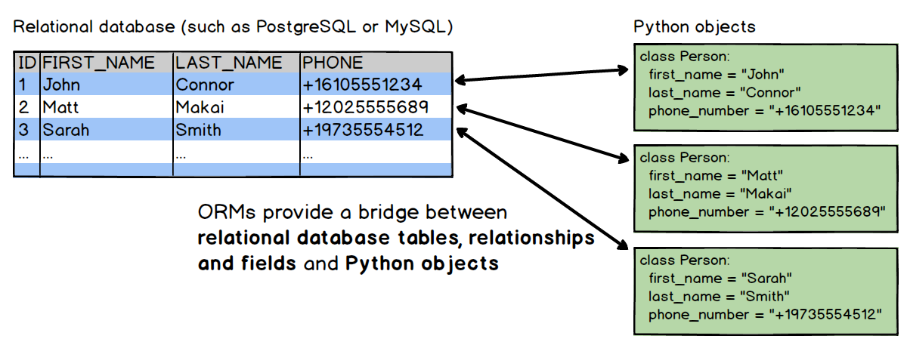

# Using an ORM

## Introduction

In this lesson, we'll learn about **_Object Relational Mappers_**, and how we can make use of SQLAlchemy to make interacting with database information clean and easy in Python!

## Objectives

You will be able to:

* Understand and explain the concept of an Object Relational Mapping
* Identify the steps needed to use sqlalchemy with a database

## Understanding Object-Relational Mappings

Relational databases excel at storing information in a clean, encapsulated way.  So do objects in an Object-Oriented language such as python! We can easily store the information contained within a row by treating each row as a separate object, with the column values corresponding to attributes for that object.  All rows in a given table must have the same columns, which is something we can easily reproduce when creating a class in Python.  The hard part is getting our data from a relational database and storing the data needed in an object to work with it in python.  Luckily, we have **_Object Relational Mappers_**, or **_ORMs_** to take care of the heavy lifting for us!




When working with an ORM, each row of data gets it's own corresponding object.  This allows us to leverage the power of Object-Oriented Programming while working with data from our relational database!


## Using SQLAlchemy 

In python, the most popular ORM is called [SQLAlchemy](https://www.sqlalchemy.org/).    For the remainder of this lesson, we'll review how to connect to a database using SQLAlchemy, and then work through basic CRUD actions using the library (Create, Read, Update, Delete). 

## 1. Setup

### Create and connect to our database

We can create and establish a connection to our new database with sqlalchemy's create_engine function. The first step is to import this function from the sqlalchemy library at the top of our schema.py file. Then, we will use this function to create a database, in this case musicians.db, with the following lines of code:

```python
import sqlalchemy

# Create an engine object, and bind it to our database. 
engine = create_engine('sqlite:///musicians.db', echo=True)

```
Technically, the database does not exist yet. We will not create the musicians database until later on when we call the engine variable.  we'll run this code once we've actually created a `Musician` class, later on. At this point, we would likely leave this at the bottom of our file or notebook, since we can't run it until we've actually set everything up. 

### Declaring A Mapping

Next, we need our Python classes to have the functionality of the **_declarative base class_**. The declarative base is responsible for cataloging our classes and tables. We import the `declarative_base` from the SQLAlchemy library at the top of our Python script with the other dependencies as so:

```python
from sqlalchemy.ext.declarative import declarative_base

Base = declarative_base()
```
We will need to import `Column`, `Integer`, `String`, `DateTime`, `ForeignKey` and `Boolean` from the SQLAlchemy library at the top of our file or notebook. By now, we are importing so much of the SQLAlchemy library that it probably makes sense to simply import all using the universal, `*`.

`from sqlalchemy import *`

### Executing Table Creation

Remember that engine variable from the very beginning that we left at the bottom of the file? Time to put it to use! We will execute the creation of our database and the musicians table with the code below. The declarative base's `metadata.create_all()` issues the SQL commands so that our database and table are up and running.

`Base.metadata.create_all(engine)`

All together, our code looks like this so far:

```python
# Import everything needed
from sqlalchemy.ext.declarative import declarative_base
from sqlalchemy import * 

# get a declarative base object
Base = declarative_base()


# The code to create the 'Musicians' table will go here. 


# The code to create and use the engine goes at the end
engine = create_engine('sqlite:///musicians.db', echo=True)
Base.metadata.create_all(engine)
```

## Part 2: Create the Schema

### Construct the` Musicians` Table

Finally, with all this setup out of the way, we are ready to create a SQL table! We mentioned above that our classes need to have the functionality of the declarative base class. How can we achieve this? We can use object inheritance! By passing our Musician class the Base instance we declared above as an argument, our Musician class will inherit all of the functionality of what commonly is referred to as the parent or super class.

`class Musician(Base):`

The table's name will be `musicians`, and it should contain the following five columns having these respective data types:

1. id - integer
1. fullname - string
1. instrument - integer (Foreign key to instruments table)
1. dob - datetime
1. alive - boolean

In addition to the `musicians` table, we'll also create an `instruments` table by creating an `Instrument` class with the following specifications:

1. id - integer
1. name - string
1. instrument_type - string

To set complete this setup, we'll make our `Musician` class meet all these constraints, like so:

```python

class Musician(Base):
   # Set the name of the table
    __tablename__ = 'musicians'

    # declare the columns and set their data types
    id = Column(Integer, primary_key=True) # Don't forget to set your id as primary key!
    fullname = Column(String)
    # Create a foreign key to the instruments table. 
    instrument = Column(Integer, ForeignKey('instruments.id')) # note that foreign key takes the name of the `instruments` table, not the `Instrument` class
    dob = Column(DateTime)
    alive = Column(Boolean)


class Instrument(Base):
    
    # set table name
    __tablename__ = 'instruments'
    
    # create columns
    id = Column(Integer, primary_key=True)
    name = Column(String)
    instrument_type = Column(String)
    

```

This brings our overall code to:

```python
# Import everything needed
from sqlalchemy.ext.declarative import declarative_base
from sqlalchemy import * 

# get a declarative base object
Base = declarative_base()


# The code to create the 'Musicians' table will go here. 
class Musician(Base):
   # Set the name of the table
    __tablename__ = 'musicians'

    # declare the columns and set their data types
    id = Column(Integer, primary_key=True) # Don't forget to set your id as primary key!
    fullname = Column(String)
    # Create a foreign key to the instruments table. 
    instrument = Column(Integer, ForeignKey('instruments.id')) # note that foreign key takes the name of the `instruments` table, not the `Instrument` class
    dob = Column(DateTime)
    alive = Column(Boolean)
    
class Instrument(Base):
    
    # set table name
    __tablename__ = 'instruments'
    
    # create columns
    id = Column(Integer, primary_key=True)
    name = Column(String)
    instrument_type = Column(String)


# The code to create and use the engine goes at the end
engine = create_engine('sqlite:///musicians.db', echo=True)
Base.metadata.create_all(engine)
```

### Let's Create Our Database!

Run the code in the cell below to create our `musicians.db` database, complete with the `musicians` table that we specified as a class. 


```python
from sqlalchemy.ext.declarative import declarative_base
from sqlalchemy import * 

# get a declarative base object
Base = declarative_base()


# The code to create the 'Musicians' table will go here. 
class Musician(Base):
   # Set the name of the table
    __tablename__ = 'musicians'

    # declare the columns and set their data types
    id = Column(Integer, primary_key=True) # Don't forget to set your id as primary key!
    fullname = Column(String)
    # Create a foreign key to the instruments table. 
    instrument = Column(Integer, ForeignKey('instruments.id'))
    dob = Column(DateTime)
    alive = Column(Boolean)
    
class Instrument(Base):
    __tablename__ = 'instruments'
    id = Column(Integer, primary_key=True)
    name = Column(String)
    instrument_type = Column(String)


# The code to create and use the engine goes at the end
engine = create_engine('sqlite:///musicians.db', echo=True)
Base.metadata.create_all(engine)
```

    2018-10-22 22:33:06,185 INFO sqlalchemy.engine.base.Engine SELECT CAST('test plain returns' AS VARCHAR(60)) AS anon_1
    2018-10-22 22:33:06,187 INFO sqlalchemy.engine.base.Engine ()
    2018-10-22 22:33:06,188 INFO sqlalchemy.engine.base.Engine SELECT CAST('test unicode returns' AS VARCHAR(60)) AS anon_1
    2018-10-22 22:33:06,189 INFO sqlalchemy.engine.base.Engine ()
    2018-10-22 22:33:06,190 INFO sqlalchemy.engine.base.Engine PRAGMA table_info("musicians")
    2018-10-22 22:33:06,190 INFO sqlalchemy.engine.base.Engine ()
    2018-10-22 22:33:06,192 INFO sqlalchemy.engine.base.Engine PRAGMA table_info("instruments")
    2018-10-22 22:33:06,192 INFO sqlalchemy.engine.base.Engine ()


## Summary

In this lesson, we learned that declaring a mapping means creating a SQLAlchemy object that takes our python class objects and maps them to our SQL tables and saves them in our database. We also learned the basic setup for importing SQLAlchemy, creating a connection to our database, creating a mapping with a SQL table, and finally how to execute creating the database.
