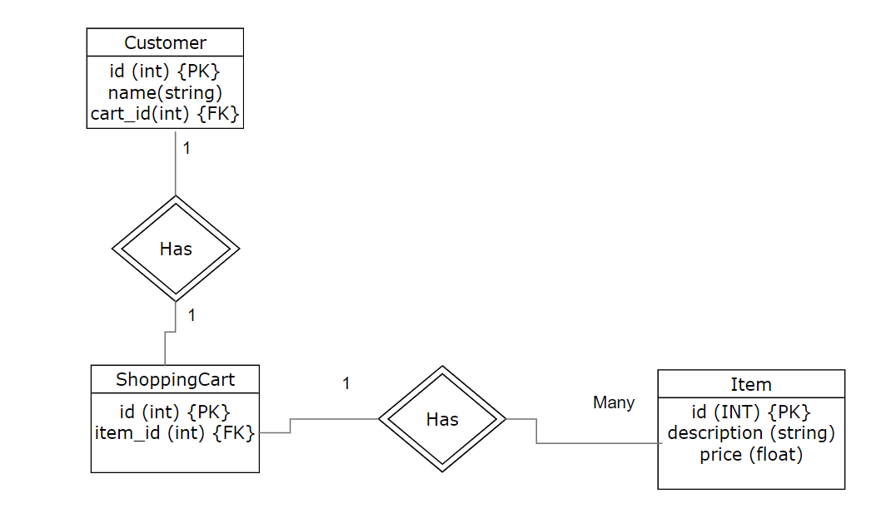

# Using an ORM - Lab

## Introduction

In this lab, we'll make use of SQLAlchemy to execute CRUD operations on a SQL database!

## Objectives

You will be able to:

* Identify the steps needed to use SQLAlchemy with a database
* Understand and explain the concept of an Object Relational Mapper
* Execute CRUD operations on a database using SQLAlchemy

## Getting Started

In this lesson, we'll make use of our newfound SQLAlchemy knowledge to create a database, populate it with data, and write queries to retrieve objects containing the information we want. 

We'll start by setting up our database. For this lesson, we're going to create then database described in the following ERD:




**_Question:_**

What sort of relationship do customers have with shopping carts? What sort of relationship do shopping carts have with items?

Write your answer below this line:
________________________________________________________________________________________________________________________________

Customers have a 1-to-1 relationship with shopping carts, while shopping carts have 1-to-many relationship with items.


### Defining Our Mappings

We'll begin by importing everything we need to create our database and structure our mappings so that they look like the tables in the ERD.  

In the cell below:

* Import everything from sqlalchemy
* Import `declarative_base` 
* Create a `Base` object


```python


Base = None
```

Good! Now, since we'll need to define relationships between our tables, we'll need to import one more thing. In the cell below, import `relationship` from sqlalchemy's `orm` module. 

**_Note_**: Make sure you import `relationship`, not the plural `relationships`!

### Creating Our Class Mappings

Now that we've created a `Base` object, we can define our classes! 

In order to set up our classes, we'll need to define:

* The `__tablename__` for each class
* The attributes of each class, which will be `Column` objects
* The `relationship` that each class has to other classes

Although we haven't explicitly covered how to create relationships, it's not hard--just a single line of code.  This is a great opportunity to get some practice finding what you need from documentation, and the SQLAlchemy documentation is really informative and easy to understand. 

We'll be creating a 1-to-1 relationship (Customer <--> ShoppingCart), and a 1-to-many relationship (ShoppingCart <--> Item). Take a look at the documentation for creating relationships and see if you can figure out how to set this up!

In the cell below: 

* Complete the `Customer`, `ShoppingCart`, and `Item` classes. 
* Give each class the correct table name ('customer', 'shoppingCart', and 'item')
* Define the correct columns for each class, with the appropriate data types, and set the appropriate primary key and foreign keys.
* Set the appropriate relationships between classes.

**_Hint:_** When setting the relationships, pay attention to the capitalization in the documentation--in some parts, you reference the name of the class, while in others, you reference the name of the table!

**_Note:_** Running a cell more than one time will cause a "Table is already defined" error.  To fix this, just restart the kernel and run everything again. 


```python
class Customer(Base):
    __tablename__ = None
    
    id = None
    name = None
    cart_id = None
    
    # Create 1-to-1 relationship with ShoppingCart, as shown in the SQLAlchemy documentation
    shoppingCart = None

```


```python
class ShoppingCart(Base):
    __tablename__ = None
    
    id = None
    item_id = None
    # Create 1-to-1 relationship with Customer
    customer = None
    # Create 1-to-many relationship with Item
    items = None
```


```python
class Item(Base):
    __tablename__ = None
    
    id = None
    description = None
    price = None
```

## Creating Our Database

Now that we've successfully defined our mappings, we can actually create our database. We'll call our database `shopping_cart.db`. 

When creating the engine, remember to put `sqlite:///` in front of the name of the database we'll be creating, and also set `echo=True`!

In the cell below:

* Create an `engine` using the appropriate method. 
* Use the `create_all()` method found inside of `Base.metadata` and pass in the engine object to create our database!


```python
engine = None


```

## CRUD Operations

We've now created a database, but our tables don't contain any data yet!

We'll need to create some objects, and then populate the database with them.

Run the cell below to some sample data for our tables.


```python
customer1 = Customer(name="Jane")
item1 = Item(description="widget", price=9.99)
cart1 = ShoppingCart(customer=customer1, items = item1)
customer1.shoppingCart = cart1
```

Note that this data has not yet been put into the database.  Before that happens, we need to create a `session` object, then add these objects and commit them. We can double check this by examining the items and seeing that they don't yet have primary keys.  Run the cell below now to demonstrate this. 


```python
customer1.id, item1.id
```

You may have noticed that we defined values for certain attributes such as the customer's name, or the item's description and price, but never attributes that act as ids.  There's a reason for this--SQLAlchemy takes care of this for us! Since every primary key has to be unique, this means that defining the integer values for primary keys would be really cumbersome, since we would need to keep track of every primary key that's been created so far--a much better task for a computer than for us!

Another thing you might have noticed is that to create relationships between objects, we just assign them to attributes that were defined as `relationship` objects when we created our mappings!

## Creating a Session Object

In order to add our new data to our database tables, we first need to create a session object. 

In the cell below:

* import `Session` and `sessionmaker` from `sqlalchemy.orm`
* create a `sessionmaker` and set the `bind=` parameter to our `engine` object. Store this in `Session`
* Instantiate a `Session()` object and store it in the variable `session`


```python

Session = None

session = None
```

Great! Now we have a session object that we can use to interact with our database.

We can add items to our database one at a time by passing them in as a parameter to `session.add()`. We can also add multiple items by passing them as a list into the `add_all()` method. In the cell below, use `add_all()` to add `customer1`, `cart1`, and `item1` into our database.


```python
session.add_all(None)
```

Adding something multiple times will not throw an error or cause duplicates.  We can see all the items that have been added by checking the session object's `.new` attribute. Do this now in the cell below.

Now, commit our objects to push them to the database. 

In the cell below, call `session.commit()`.

If we check the object ids again, we'll see that they now have values for their primary keys.

In the cell below, check the `.id` attribute of `customer1`.

## Summary

In this lab, we created a database with SQLAlchemy, defined our mappings to structure the tables, and even added some data to the database. Great job! 
