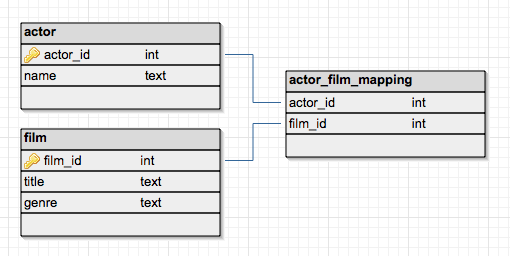
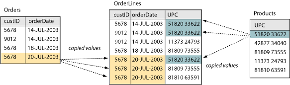

# Review: Many-to-Many Relationships

## Introduction

In this lesson, we'll review the concept of many-to-many relationships, and how we can use join tables to write queries that involve many-to-many relationships. 

## Objectives

You will be a ble to:

* Understand and idenitify many-to-many relationships
* Many use of join tables for joining tables with many-to-many relationships

## Review: Example Many-to-Many Relationships

Recall that some tables will have many-to-many relationships. This refers to when a parent in one table has several child rows in a second table, and vice versa.  

Let's review some real-world examples of many-to-many relationships:

1. Actors and Films. An actor is in multiple films, and each film contains multiple actors. 

1. Books and authors. Authors write many books, and sometimes books have more than one author. 

1. Sales people and customers. Sales people will often have many clients, and clients will often deal with more than one sales associate. 

1. Students and Classes. Each student takes more than 1 class, and each class contains multiple students. 

1. Users and permissions. A user may have multiple permissions, and each level of permissions has been granted to many users. 

Although we can create a table for each of the entities in the examples above, we can't compute JOIN statements with just those two tables--for that, we need to make use of an **_Associative Entity_**, also known as a **_Join Table_**.

## Join Tables and Associative Entities 

Because of this unique many-to-many relationship, we cannot compute JOIN statements with many to many relationships while just using the two tables. In order to make JOINs possible, we need an intermediary table called a _Join Table_. Join Tables act as a bridge between the two entities with the many-to-many relationship that allow us to easily query them for information.  

In relational database theory, these are also referred to **_Associative Entities_**, because they do not exist independently as a base entity such as a Customer--rows in a Join Table only exist to describe the relationship between two base entities. In practice, these are most often referred to as Join Tables.  However, you'll hear plenty of other names for them, such as:

* Join Table
* Associative Entity
* Association Table
* Bridge Table
* Cross-Reference Table
* Crosswalk
* Linking Table
* Mapping Table

### The Anatomy of a Join Table

As you can see in the diagram above, the structure of join tables are quite simple. Usually Join Tables consist of a **_Composite Primary Key_** consisting of the two foreign keys which point to each of the base entities in the relationship. 

Note the example data in the diagram above. To cover all the links between orders and products, the row for the highlighted order is repeated three times, with a different UPC for each row in the 'OrderLines' table. Each permutation of this represents a link between the single highlight order in the 'Orders' table and a unique product.  To put it simply, we can easily interpret this as the "The order placed on 20-July-2003 by Customer 5678 contained 3 products".  By leveraging the join table in our queries, we can now easily write queries that deal with tables with many-to-many relationships.  

## Summary

In this lesson, we learned how to:

* Understand and idenitify many-to-many relationships
* Many use of join tables for joining tables with many-to-many relationships
