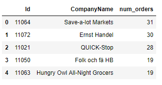
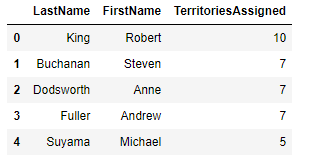

# Querying with SQLAlchemy - Lab

## Introduction

In this lesson, we'll learn how to use SQLAlchemy to write queries about Microsoft's _Northwind Traders_ database!

## Objectives

You will be able to:

* Read and understand an ERD diagram
* Create queries with SQLAlchemy, including queries that involve many-to-many relationships

## Getting Started

In order to complete this lab, we'll need to download a SQLite3-compatible version of the _Northwind Traders_ database from Microsoft.  Microsoft built this database back in the year 2000 to help showcase their SQL Server technology. Since then, it has been open-sourced and has become a great practice tool for every new generation of SQL learners. 

Lucky for us, some generous programmers have already converted the Northwind database to a sqlite-compatible version and posted it on Github. We've already included the file the SQL database file that we'll be working with in the repo for this folder, along with the following ERD Diagram. However, if you would like to work with the larger version of this dataset at a future time, just clone [this repo](https://github.com/jpwhite3/northwind-SQLite3) and follow their instructions to access it!

## ERD Diagram For Northwind Traders

The following ERD Diagram describes the Northwind Traders Database:


If the text seems a bit hard to read inside this jupyter notebook, just go into the folder for this repo and open the `Northwind_ERD.png` file manually to see it full size. 

## Connecting to the Database

The first thing we'll need to do is connect to the Northwind Traders database, which can be found in the file `Northwind_small.sqlite`.

In the cell below, import the necessary tools from the `sqlalchemy` library, and take the necessary steps to connect to the database.

**_NOTE:_** We won't be modifying the information in the database at all, just querying it, so there's no need to import the various things you would need to create declarative base classes and the like.


```python
import sqlalchemy
from sqlalchemy import create_engine
from sqlalchemy.orm import Session, sessionmaker

engine = None
Session = None
session = None
```

## Get Table Names and Table Information

One of the most useful things we can do when working with a new database is to inspect the tables until we have a solid idea of what we're looking at.  As you work through this lab, you'll notice that there are some small discrepancies between the Table/Column names listed in the ERD and what they are actually are in the database.  This may be annoying, but this is not an accident--sometimes, documentation is wrong!  By learning how to inspect what tables exist in a database, as well as how which columns exist inside a table, we can save ourselves a lot of headaches by double checking. 

In the cell below:

* Import `inspect` from sqlalchemy
* Create an inspector object by passing in `engine` to `inspect`
* Use the appropriate inspector function to get the names of all tables


```python


inspector = None

print(None)
```

Great! We can now see exactly what each Table is named. 

**_Question_**:

Are there any discrepancies between the table names and the ERD diagrams? if so, what are they?

Write your answer below this line:
________________________________________________________________________________________________________________________________


Let's inspect the column names on one of the tables as well. In the cell below, call the appropriate method to get all column names for the `'Employee'` table. 


```python
print(None)
```

That output is good, but its a bit messy. Let's write a function that makes it a bit more readable, and only tells us what we need to know. 

The current structure of the output is a list of dictionaries. Complete the function below so that when the function is called and passed a table name, it prints out the name and type of each column in a well-formatted way. 


```python
def get_columns_info(col_name):
    cols_list = None
    
    print("Table Name: {}".format(None))
    print("")
    
    for None in None:
        print("Name: {} \t Type: {}".format(None, None))

get_columns_info('Employee')
```
# Expected Output:

Table Name: Employee

Name: Id 	 Type: INTEGER
Name: LastName 	 Type: VARCHAR(8000)
Name: FirstName 	 Type: VARCHAR(8000)
Name: Title 	 Type: VARCHAR(8000)
Name: TitleOfCourtesy 	 Type: VARCHAR(8000)
Name: BirthDate 	 Type: VARCHAR(8000)
Name: HireDate 	 Type: VARCHAR(8000)
Name: Address 	 Type: VARCHAR(8000)
Name: City 	 Type: VARCHAR(8000)
Name: Region 	 Type: VARCHAR(8000)
Name: PostalCode 	 Type: VARCHAR(8000)
Name: Country 	 Type: VARCHAR(8000)
Name: HomePhone 	 Type: VARCHAR(8000)
Name: Extension 	 Type: VARCHAR(8000)
Name: Photo 	 Type: BLOB
Name: Notes 	 Type: VARCHAR(8000)
Name: ReportsTo 	 Type: INTEGER
Name: PhotoPath 	 Type: VARCHAR(8000)
## Connecting and Executing Raw SQL Statements

Sometimes, the easiest thing for us to do is to just execute a raw SQL statement.  This is very easy with SQLAlchemy--we just need to establish a connection, and then use the appropriat methods to execute SQL statements!

In the cell below:

* Create a connection using the `engine` object's appropriate method and store it in the variable `con`
* Use the appropriate method from `con` to execute a raw SQL statement (in the form of a string) that gets everything from the `'Customer'` table with a LIMIT of 5. Store the results returned in the variable `rs`
* Use the `fetchall()` method to display all results from `rs`.


```python
con = None
rs = None

print(None)
```
# Expected Output:

[('ALFKI', 'Alfreds Futterkiste', 'Maria Anders', 'Sales Representative', 'Obere Str. 57', 'Berlin', 'Western Europe', '12209', 'Germany', '030-0074321', '030-0076545'), ('ANATR', 'Ana Trujillo Emparedados y helados', 'Ana Trujillo', 'Owner', 'Avda. de la Constitución 2222', 'México D.F.', 'Central America', '05021', 'Mexico', '(5) 555-4729', '(5) 555-3745'), ('ANTON', 'Antonio Moreno Taquería', 'Antonio Moreno', 'Owner', 'Mataderos  2312', 'México D.F.', 'Central America', '05023', 'Mexico', '(5) 555-3932', None), ('AROUT', 'Around the Horn', 'Thomas Hardy', 'Sales Representative', '120 Hanover Sq.', 'London', 'British Isles', 'WA1 1DP', 'UK', '(171) 555-7788', '(171) 555-6750'), ('BERGS', 'Berglunds snabbköp', 'Christina Berglund', 'Order Administrator', 'Berguvsvägen  8', 'Luleå', 'Northern Europe', 'S-958 22', 'Sweden', '0921-12 34 65', '0921-12 34 67')]
## Incorporating Pandas DataFrames

So far we've been able to easily connect to a SQL database, inspect the tables, and execute queries. However, the results returned from queries haven't been in an easily readable format.  We'll fix that by taking the results and storing it in a pandas DataFrame!

In the cell below:

* Import pandas and set the standard alias.
* Create and execute a query that gets The firstname, lastname, and title of every person in the `'Employee'` table.
* Create a pandas DataFrame out of the results returned from `rs.fetchall()`
* Display the head of the new DataFRame


```python


rs = None
df = None
df.head()
```

Nice! We can now read our results.  However, the columns of our DataFrame aren't labeled.  Luckily, pandas plays nicely with the sqlalchemy library, and can actually execute sql queries!

### Writing Queries with Pandas

In the cell below:

* Use the appropriate method from pandas to select all columns for every row in the `[Order]` table where the customer is `'VINET'`
* Be sure to pass in our `engine` as the 2nd parameter, otherwise it won't work!
* Display the head of the DataFrame created to ensure everything worked correctly.


```python
df = None
df.head()
```

Great! As we can see from the output above, when we let pandas execute the SQL query for us, the DataFrame now contains columns with the correct labels. This is a great way to execute SQL while still making sure our results are easy to read and manipulate by using DataFrames!

## Executing JOIN Statements

Let's try executing a JOIN statement inside `pd.read_sql_query`.

In the cell below:

* Write a query that gets the Order ID, Company Name, and the total count of orders made by each company (as num_orders).
* Group the results by Company Name
* Order the results by num_orders, descending
* Display the head of the DataFrame to ensure everything worked correctly.


```python
df = None
df.head()
```

### Expected Output



Great job! Let's see if we can execute a join that includes entities with a many-to-many relationship.

### JOINs with Many-To-Many Relationships

In the cell below:

* Write a query that selects the LastName, FirstName and number of territories assigned for every employee. 
* Group the results by employee lastname
* Order by the total number of territories assigned to each employee, descending
* You'll need to make use a join table to solve this one--be sure to take a look at the ERD diagram again if needed!
* Store your results in a DataFrame and display the head to ensure that everything worked correctly.

**_NOTE:_** For long SQL statements, consider using the multiline string format in python, denoted by `"""three quotes"""` at the beginning and end.  Note that if you hit enter to move to another line, be sure to add an `\` character at the end of the line to escape it--otherwise, your sql statements will contain `\n` newline characters wherever you hit enter to move to the next line.  


```python
q = None

df2 = pd.read_sql_query(None, None)
df2.head()
```

#### Expected Output:



Great job! You've demonstrated proficiency using raw sql with SQLAlchemy. However, we haven't yet touched all the fun declarative stuff.  Let's get some practice working with SQLAlchemy `session` objects below!

## Using SQLAlchemy Sessions

So far, we've just been using SQLAlchemy as a way to connect to a database and run SQL queries. However, SQLAlchemy is an **_Object-Relational Mapper_**, and can map entities in our database to python objects! This can be incredibly helpful when we need to incorporate data from our database into an object-oriented program or model. 

Let's start by getting some practice with `session` objects, because that's where all the magic happens.

### Using `.query` Objects

Recall that we created a `session` object at the beginning of this lab by using SQLAlchemy's `sessionmaker` function and binding it to our `engine` object.  We haven't used our `session` object too much thus far, but now we'll use it for queries!

The `session` object contains a `.query()` method which returns a query object containing the results of our query, with the results mapped to objects.  

Before we can make use of Object-Relational Mappings, we need to make sure that we have mappings created that map the tables in our existing database to objects in python.  We don't want to have to do this manually, so we'll make use the `automap` module inside of `sqlalchemy.ext`.

In the cell below:

* Import `MetaData` from `sqlalchemy`
* Import `automap_base` from `sqlalchemy.ext.automap`
* Create a `MetaData` object
* Use the metadata object's `reflect` method on our `engine`
* Call `automap_base` and set the `metadata` parameter to our `metadata`. Store the results returned inside of the variable `Base`
* Call `base.prepare()`
* Map `Employee` and `Customer` to the `Employee` and `Customer` classes, which can be found inside of `Base.classes`


```python


metadata = None

metadata.reflect(None)

Base = None

# Don't forget to .prepare()!

Employee, Customer = None, None
```

Now that we have some mappings set up, we can make use of `session.query()` help us query our database!

### Writing Basic Queries

Let's use the `query()` object to get all the employees from the `'Employee'` table. 

In the cell below:

* Create a for loop that iterates through the results returned by a `session.query()` of the Employee table (pass this as a variable, not a string).
* Order the results by the Employee's `.HireDate` attribute.
* Print the last name, first name, and hire date of each employee. 

### Implicit JOINs using `.filter()`

One great benefit of using `session.query()` to query our data is that we can easily execute **_implicit joins_** by making use of the `.filter()` method. 

So far we've only explicitly specified mappings for the `Employee` and `Customer` classes.  We'll need to do this now for the `Product` and `Category` classes before we can use them with `session.query()`.

In the cell below, set the mappings for `Product` and `Category`.

**_HINT:_** This will look just like the last line of the code cell where we declared our mappings previously.  No need to repeat all the steps for getting metadata and creating a `Base` class. Just set the mappings!


```python
Product, Category = None, None
```

Great!

Now, in the cell below:

* Create a for loop that iterates through all results returned from a query of Products and Categories
* Use the `.filter()` method to only include cases where the Product's `.CategoryID` matches the Category's `.Id` attribute.
* Print out the name of each product, followed by the name of the category that it belongs to. 

## Summary

Great job! You've just used SQLAlchemy to work with a sample production database. Note that there are many, many more awesome things that SQLAlchemy can do, but they're outside the scope of this lesson.  However, if you're interested in learning more, don't be afraid to take a look at the [SQLAlchemy documentation](https://docs.sqlalchemy.org/en/latest/orm/tutorial.html) and work through some tutorials in your spare time!
