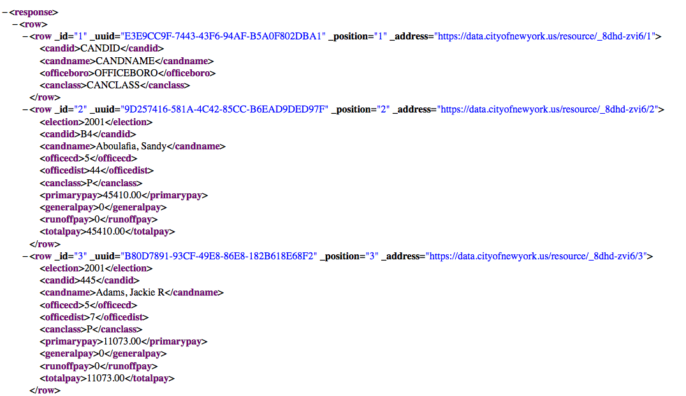
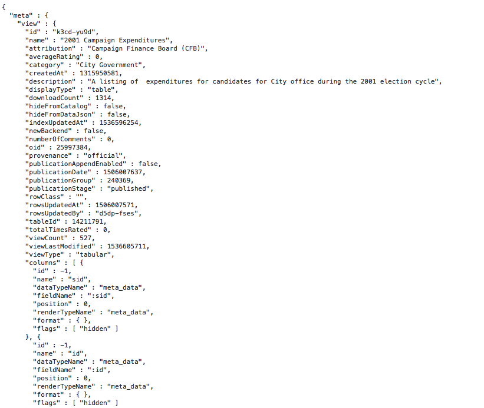
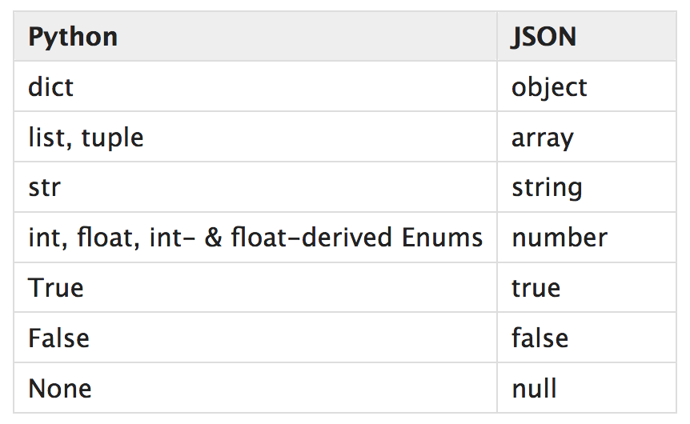

# JSON and XML

## Introduction

In this lecture, we'll continue investigating new formats for datasets. Specifically, we'll investigate two of the most popular data formats for the web: JSON and XML including strengths and weaknesses.

## Objectives
You will be able to:
* Effectively use the JSON module to load and parse JSON documents
* Read and access data stored in JSON and XML
* Compare  and contrast the JSON and XML as data interchange types


## XML

XML stands for 'Extensible Markup Language'. You may note the acronym's similarity to HTML; HyperText Markup Language. While HTML tells us how to display a page, XML is used to store the data and content of the page itself. Like HTML, xml uses tags to seperate and organize data in a hierarchical manner. Here's a brief preview of an XML file:  



## JSON

JSON stand for JavaScript Object Notation. It came after XML and was meant to streamline many data transportation issues at the time. It is now the common standard amongst data transfers on the web and has numerous parsing packages for numerous languages (including Python)! Here's a brief preview of the same file above now in JSON:  


## Loading XML and JSON Data
For both of these data formats, prebuilt modules exist that will give us a powerful starting point for accessing and manipulating the underlying data itself. As you'll see the newer version, JSON, is simpler and more flexible then its predecessor XML.

### The XML Module

You can check out the full details of the XML package here:  
https://docs.python.org/3.6/library/xml.html#  
but we'll be simply using a submodule, ElementTree:   
https://docs.python.org/3.6/library/xml.etree.elementtree.html#module-xml.etree.ElementTree  

Notice the nested structure of the XML file:  

  

When parsing the data, we'll have to navigate through this hierarchical structure. This is the idea behind the `ElementTree` submodule that we'll be using. We'll start with a root note and then iterate over its children, each of which should have a tag (the name in <angle_brackets\>) and an associated attribute (the data between the two angle brackets <start\> data <stop\>).


```python
import xml.etree.ElementTree as ET
```

First we create the tree and retrieve the root tag.


```python
tree = ET.parse('nyc_2001_campaign_finance.xml')
root = tree.getroot()
```

Afterwards, we can iterate through the root node's children:


```python
for child in root:
    print(child.tag, child.attrib)
```

    row {}


Due to the nested structure, you often have to dig further down the tree:


```python
#Count is added here to limit the number of results
count = 0
for child in root:
    print('Child:\n')
    print(child.tag, child.attrib)
    print('Grandchildren:')
    for grandchild in child:
        count += 1
        if count < 10:
            print(grandchild.tag, grandchild.attrib)
    print('\n\n')
```

    Child:
    
    row {}
    Grandchildren:
    row {'_id': '1', '_uuid': 'E3E9CC9F-7443-43F6-94AF-B5A0F802DBA1', '_position': '1', '_address': 'https://data.cityofnewyork.us/resource/_8dhd-zvi6/1'}
    row {'_id': '2', '_uuid': '9D257416-581A-4C42-85CC-B6EAD9DED97F', '_position': '2', '_address': 'https://data.cityofnewyork.us/resource/_8dhd-zvi6/2'}
    row {'_id': '3', '_uuid': 'B80D7891-93CF-49E8-86E8-182B618E68F2', '_position': '3', '_address': 'https://data.cityofnewyork.us/resource/_8dhd-zvi6/3'}
    row {'_id': '4', '_uuid': 'BB012003-78F5-406D-8A87-7FF8A425EE3F', '_position': '4', '_address': 'https://data.cityofnewyork.us/resource/_8dhd-zvi6/4'}
    row {'_id': '5', '_uuid': '945825F9-2F5D-47C2-A16B-75B93E61E1AD', '_position': '5', '_address': 'https://data.cityofnewyork.us/resource/_8dhd-zvi6/5'}
    row {'_id': '6', '_uuid': '9546F502-39D6-4340-B37E-60682EB22274', '_position': '6', '_address': 'https://data.cityofnewyork.us/resource/_8dhd-zvi6/6'}
    row {'_id': '7', '_uuid': '4B6C74AD-17A0-4B7E-973A-2592D68A687D', '_position': '7', '_address': 'https://data.cityofnewyork.us/resource/_8dhd-zvi6/7'}
    row {'_id': '8', '_uuid': 'ABD22A5E-B8DA-446F-82BC-93AA11AF99DF', '_position': '8', '_address': 'https://data.cityofnewyork.us/resource/_8dhd-zvi6/8'}
    row {'_id': '9', '_uuid': '7CD36FB5-600F-44F5-A10C-CB3434B6805F', '_position': '9', '_address': 'https://data.cityofnewyork.us/resource/_8dhd-zvi6/9'}
    
    
    


Due to the nested structure, there is also a convenience method .iter() that allows you to iterate through all sub generations, regardless of depth.


```python
count = 0
for element in root.iter():
    count += 1
    if count < 10:
        print(element.tag, element.attrib)
```

    response {}
    row {}
    row {'_id': '1', '_uuid': 'E3E9CC9F-7443-43F6-94AF-B5A0F802DBA1', '_position': '1', '_address': 'https://data.cityofnewyork.us/resource/_8dhd-zvi6/1'}
    candid {}
    candname {}
    officeboro {}
    canclass {}
    row {'_id': '2', '_uuid': '9D257416-581A-4C42-85CC-B6EAD9DED97F', '_position': '2', '_address': 'https://data.cityofnewyork.us/resource/_8dhd-zvi6/2'}
    election {}


With some finesse, we could also extract all of these row tags into a dataframe....


```python
dfs = []
for n, element in enumerate(root.iter('row')):
    if n > 0:
        dfs.append(pd.DataFrame.from_dict(element.attrib, orient='index').transpose())
df = pd.concat(dfs)
print(len(df))
df.head()
```

    285


<div>
<style scoped>
    .dataframe tbody tr th:only-of-type {
        vertical-align: middle;
    }

    .dataframe tbody tr th {
        vertical-align: top;
    }

    .dataframe thead th {
        text-align: right;
    }
</style>
<table border="1" class="dataframe">
  <thead>
    <tr style="text-align: right;">
      <th></th>
      <th>_id</th>
      <th>_uuid</th>
      <th>_position</th>
      <th>_address</th>
    </tr>
  </thead>
  <tbody>
    <tr>
      <th>0</th>
      <td>1</td>
      <td>E3E9CC9F-7443-43F6-94AF-B5A0F802DBA1</td>
      <td>1</td>
      <td>https://data.cityofnewyork.us/resource/_8dhd-z...</td>
    </tr>
    <tr>
      <th>0</th>
      <td>2</td>
      <td>9D257416-581A-4C42-85CC-B6EAD9DED97F</td>
      <td>2</td>
      <td>https://data.cityofnewyork.us/resource/_8dhd-z...</td>
    </tr>
    <tr>
      <th>0</th>
      <td>3</td>
      <td>B80D7891-93CF-49E8-86E8-182B618E68F2</td>
      <td>3</td>
      <td>https://data.cityofnewyork.us/resource/_8dhd-z...</td>
    </tr>
    <tr>
      <th>0</th>
      <td>4</td>
      <td>BB012003-78F5-406D-8A87-7FF8A425EE3F</td>
      <td>4</td>
      <td>https://data.cityofnewyork.us/resource/_8dhd-z...</td>
    </tr>
    <tr>
      <th>0</th>
      <td>5</td>
      <td>945825F9-2F5D-47C2-A16B-75B93E61E1AD</td>
      <td>5</td>
      <td>https://data.cityofnewyork.us/resource/_8dhd-z...</td>
    </tr>
  </tbody>
</table>
</div>


### Shew!
As you can see, parsing XML can get a bit complicated. It's a useful example for when we begin web scraping as HTML will have a similar structure that we'll need to exploit. That said, XML is an outdated format, and JSON is the standard. So with that, let's turn our attention to the format you'll be most apt to work with and encounter: JSON!!

## The JSON Module

https://docs.python.org/3.6/library/json.html


```python
import json
```

To load a json file, we first open the file using python's built in function and then pass that file object to the json module's load method. As you can see, this loaded the data as a dictionary.


```python
f = open('nyc_2001_campaign_finance.json')
data = json.load(f)
print(type(data))
```

    <class 'dict'>


Json files are often nested in a hierarchical structure and will have data structures analogous to python dictionaries and lists. We can begin to investigate a particular file by using our traditional python methods. Here's all of the built in supported data types in JSON and their counterparts in python: 



Check the keys of the dictionary:


```python
data.keys()
```


    dict_keys(['meta', 'data'])


Investigate what data types are stored within the values associated with those keys:


```python
for v in data.values():
    print(type(v))
```

    <class 'dict'>
    <class 'list'>


We can quickly preview the first dictionary as a DataFrame


```python
pd.DataFrame.from_dict(data['meta'])
```


<div>
<style scoped>
    .dataframe tbody tr th:only-of-type {
        vertical-align: middle;
    }

    .dataframe tbody tr th {
        vertical-align: top;
    }

    .dataframe thead th {
        text-align: right;
    }
</style>
<table border="1" class="dataframe">
  <thead>
    <tr style="text-align: right;">
      <th></th>
      <th>view</th>
    </tr>
  </thead>
  <tbody>
    <tr>
      <th>attribution</th>
      <td>Campaign Finance Board (CFB)</td>
    </tr>
    <tr>
      <th>averageRating</th>
      <td>0</td>
    </tr>
    <tr>
      <th>category</th>
      <td>City Government</td>
    </tr>
    <tr>
      <th>columns</th>
      <td>[{'id': -1, 'name': 'sid', 'dataTypeName': 'me...</td>
    </tr>
    <tr>
      <th>createdAt</th>
      <td>1315950830</td>
    </tr>
    <tr>
      <th>description</th>
      <td>A listing of public funds payments for candida...</td>
    </tr>
    <tr>
      <th>displayType</th>
      <td>table</td>
    </tr>
    <tr>
      <th>downloadCount</th>
      <td>1470</td>
    </tr>
    <tr>
      <th>flags</th>
      <td>[default, restorable, restorePossibleForType]</td>
    </tr>
    <tr>
      <th>grants</th>
      <td>[{'inherited': False, 'type': 'viewer', 'flags...</td>
    </tr>
    <tr>
      <th>hideFromCatalog</th>
      <td>False</td>
    </tr>
    <tr>
      <th>hideFromDataJson</th>
      <td>False</td>
    </tr>
    <tr>
      <th>id</th>
      <td>8dhd-zvi6</td>
    </tr>
    <tr>
      <th>indexUpdatedAt</th>
      <td>1536596254</td>
    </tr>
    <tr>
      <th>metadata</th>
      <td>{'rdfSubject': '0', 'rdfClass': '', 'attachmen...</td>
    </tr>
    <tr>
      <th>name</th>
      <td>2001 Campaign Payments</td>
    </tr>
    <tr>
      <th>newBackend</th>
      <td>False</td>
    </tr>
    <tr>
      <th>numberOfComments</th>
      <td>0</td>
    </tr>
    <tr>
      <th>oid</th>
      <td>4140996</td>
    </tr>
    <tr>
      <th>owner</th>
      <td>{'id': '5fuc-pqz2', 'displayName': 'NYC OpenDa...</td>
    </tr>
    <tr>
      <th>provenance</th>
      <td>official</td>
    </tr>
    <tr>
      <th>publicationAppendEnabled</th>
      <td>False</td>
    </tr>
    <tr>
      <th>publicationDate</th>
      <td>1371845179</td>
    </tr>
    <tr>
      <th>publicationGroup</th>
      <td>240370</td>
    </tr>
    <tr>
      <th>publicationStage</th>
      <td>published</td>
    </tr>
    <tr>
      <th>query</th>
      <td>{}</td>
    </tr>
    <tr>
      <th>rights</th>
      <td>[read]</td>
    </tr>
    <tr>
      <th>rowClass</th>
      <td></td>
    </tr>
    <tr>
      <th>rowsUpdatedAt</th>
      <td>1371845177</td>
    </tr>
    <tr>
      <th>rowsUpdatedBy</th>
      <td>5fuc-pqz2</td>
    </tr>
    <tr>
      <th>tableAuthor</th>
      <td>{'id': '5fuc-pqz2', 'displayName': 'NYC OpenDa...</td>
    </tr>
    <tr>
      <th>tableId</th>
      <td>932968</td>
    </tr>
    <tr>
      <th>tags</th>
      <td>[finance, campaign finance board, cfb, nyccfb,...</td>
    </tr>
    <tr>
      <th>totalTimesRated</th>
      <td>0</td>
    </tr>
    <tr>
      <th>viewCount</th>
      <td>233</td>
    </tr>
    <tr>
      <th>viewLastModified</th>
      <td>1536605717</td>
    </tr>
    <tr>
      <th>viewType</th>
      <td>tabular</td>
    </tr>
  </tbody>
</table>
</div>


Notice the column names which will be very useful!

Investigate further information about the list stored under the 'data' key:


```python
len(data['data'])
```


    285


Previewing the first entry:


```python
data['data'][0]
```


    [1,
     'E3E9CC9F-7443-43F6-94AF-B5A0F802DBA1',
     1,
     1315925633,
     '392904',
     1315925633,
     '392904',
     '{\n  "invalidCells" : {\n    "1519001" : "TOTALPAY",\n    "1518998" : "PRIMARYPAY",\n    "1519000" : "RUNOFFPAY",\n    "1518999" : "GENERALPAY",\n    "1518994" : "OFFICECD",\n    "1518996" : "OFFICEDIST",\n    "1518991" : "ELECTION"\n  }\n}',
     None,
     'CANDID',
     'CANDNAME',
     None,
     'OFFICEBORO',
     None,
     'CANCLASS',
     None,
     None,
     None,
     None]


## Summary
As you can see, there's still a lot going on here with the deeply nested structure of some of these data files. In the upcoming lab, you'll get a chance to practice loading files and conducting some initial preview of the data as we did here.
