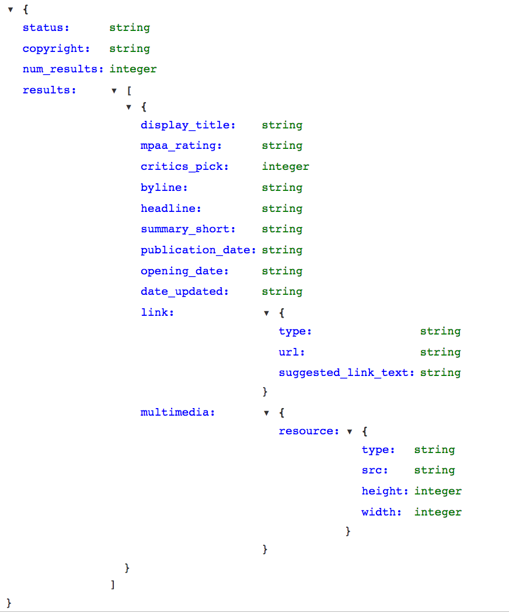

# Working with Known JSON Schemas - Lab

## Introduction
In this lab you'll practice working with json files whose schema you know beforehand.

## Objectives
You will be able to:
* Read JSON Documentation Schemas and translate into code
* Extract data from known json schemas
* Write data to predefined JSON schemas

## Reading a JSON Schema

Here's the JSON schema provided for a section of the NY Times API:


or a fully expanded view:



You can see this yourself here:
https://developer.nytimes.com/movie_reviews_v2.json#/Documentation/GET/critics/%7Bresource-type%7D.json

You can see that the master structure is a dictionary and has a key named 'response'. This is also a dictionary and has two keys: 'data' and 'meta'. As you continue to examine the schema hierarchy, you'll notice the vast majority in this case are dictionaries. 

## Loading the Data File

Start by importing the json file. The sample response from the api is stored in a file **ny_times_movies.json**


```python
#Your code here
```

## Loading Specific Data

Create a DataFrame of the major data container within the json file, listed under the 'results' heading in the schema above.


```python
#Your code here
```

## How many unique critics are there?


```python
#Your code here
```

## Create a new column for the review's url. Title the column 'review_url'


```python
#Your code here
```

## How many results are in the file?


```python
#Your code here
```

## Summary
Well done! Here you continued to gather practice extracting data from JSON files and transforming them into our standard tool of Pandas DataFrames.
