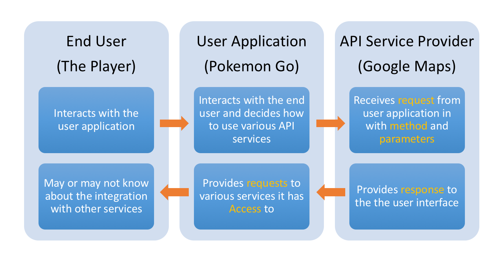

# Introduction to APIs

## Introduction 

**_APIs_** (short for **_Application Programming Interfaces_**) are an important aspect of the modern internet. APIs are what allows everything on the internet to play nicely with each other and work together. In this lesson, we'll learn all about what APIs are, what they are used for, and how they work. 

## Objectives
You will be able to : 
* Understand and explain what an API is
* Understand and explain why companies build APIs

## Application Programming Interface (API)

> API stands for **Application Programming Interface**. 

An API is a communication protocol between 2 software systems. It describes the mechanism through which if one system **requests** some information using a predefined format, a remote system **responds** with an outcome that gets sent back to the first system. 

APIs are a way of allowing 2 applications to interact with each other. This is an incredibly common task in modern web-based programs. For instance, if you've ever connected your facebook profile to another service such as Spotify or Instagram, this is done through APIs. An API represents a way for 2 pieces of software to interact with one another. Under the hood, the actual request and response is done as a **_HTTP Request_**. Then following diagram shows the **_HTTP Request/Response Cycle_**:

APIs are a way of standardizing interactions with software. From the provider's standpoint, it makes sure that everyone will interact with their software in a way that they are expecting. From the user's standpoint, it provides easy instructions and methods for working with 3rd party software, which opens up a ton of useful benefits by allowing us to get data from other sources, or add functionality by incorporating services from 3rd party software!

### An Example

Pokemon Go has been one of the most popular smartphone games, which requires a large ecosystem with complete information of routes and roads across the globe. Developers of the Pokemon could not have possibly coded such a complete world map. Instead, they used Google maps API and built their app on top of it. Following image shows the complete architecture that allows players of pokemon go to play a game which in turns responds by making geographical information related API calls to google maps.  

### What is an API made of ?

APIs are very common in tech world, which means that are many, many different kinds that you're going to run into. While each API you work with will be unique in some way, there are some common traits you can expect to see overall. An API has three main components as listed below:

* **Access Permissions:** Is the user allowed to ask for data or services?
* **Request:** The service being asked for (e.g., if I give you current location using GPS, tell me the map around that place - as we see in Pokemon Go).  A Request has two main parts:

    * **Methods:** Once the access is permitted, what questions can be asked.
    
    * **Parameters:** Additional details that can be sent with requests or responses

* **Response:** The data or service as a result of the request.

We'll look more deeply at how to use these components in the upcoming lessons for this section. For now, our goal is to understand that APIs:

* Provide a standardized way of letting us interact with 3rd party software/services
* Consist of a **_Request_** and a **_Response_**
* Can have special **_Access Permissions_** depending on the API and the the user making the request. 

## Summary

In this lesson, we looked at an introduction to APIs, their basic understanding and main types of APIs.  In following lessons, we dig into this in a bit more detail and see how to make API calls in python. 
