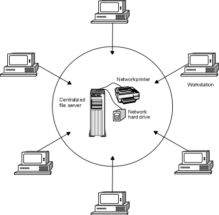
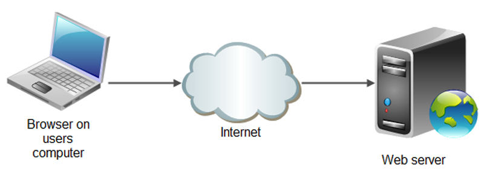
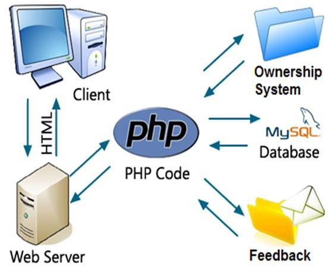
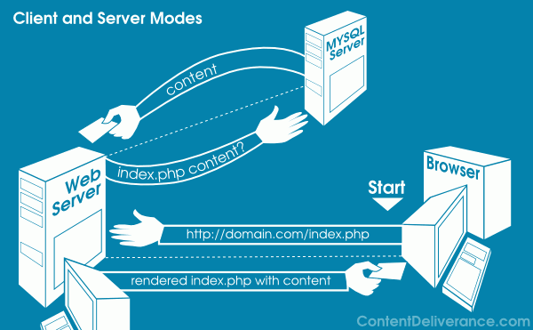

# The Client Server Model 

## Introduction

In this lesson, we shall look at the relationship between clients and server computers that you may find present The Client/server architecture offers a an unlimited number of communication possibilities  and it is is what makes the Internet **possible**. We shall cover a basic understanding of the client/server model which will be later used for API calling. It is beyond the scope of this lesson to cover an exhaustive resource for client/server architecture.We shall, instead, look at the primary principals of communication

## Obectives
You will be able to:

* Understand and explain the relationship between clients and servers

## The Client/Server Model 

The client/server model of communication technologies is a set of distributed application architecture and network operations that manages the workloads between the providers of a service, called **servers**, and service requester, called **clients**. 

Although Client/server model can be used by programs within a individual computer, we shall focus on the aspect that deals with networked environments. In this case, the client set up a connection to the server over a local area network (LAN), a wide-area network (WAN) such as the Internet. Have you ever played Xbox Live or used the PlayStation Network? Your Xbox One is the client, and when it logs into the network, it contacts the Xbox Live servers to retrieve gaming resources like updates, video, and game demos.

A typical multi-layered client server architecture that most of us use in everyday life can be shown as below. 

### What is a Client?
A client is a computer hardware device or software that requests a service made available by a server. The server is often (but not always) located on a separate physical computer.

### What is a Server?
A server is a physical computer dedicated to run services to serve the needs of clients. Depending on the service that is running, it could be a file server, database server, home media server, print server, email server or a **web server**.

## Client/Server Model on the Web

The idea of a Client and Server communicating over a network is what makes viewing websites  and interacting with Web applications (like Gmail, Facebook, LinedIn) possible. This model is a way to describe the give-and-take relationship between the client and server in a Web application and governs how information passes between computers. 

Let's see what a basic web application looks like that takes in a a request from an web client and serves accordingly. 

## Web Applications

A Web application (Web app) is an application program that is stored on a remote server and delivered over the Internet through a browser interface. Web services are Web apps by definition and many, although not all, websites contain Web apps. Any website component that performs some function for the user qualifies as a Web app. Google’s search engine is a web app, yet its root concept is hardly different from a phone directory that enables you to search names or numbers. 

Most web apps actually use a browser interface for interaction, i.e. end users request access and request information/service from these applications through a modern web browser interface. There are hundreds of ways to build and configure a Web application but most of them follow the same basic structure: a web client, a web server, and a database.

### The Web client 

The client is what the end user interacts with. "Client-side" code is actually responsible for most of what a user actually sees. For a requesting some information as a web page, the client side may be responsible for: includes:

1.  Defining the structure of the Web page 
2.  Setting the look and feel of the Web page 
3.  Implementing a mechanism for responding to user interactions (clicking buttons, entering text, etc.)

Most of these tasks are managed by HTML/CSS/Java-Script like technologies to structure the information, style of the page and provide interactive objects for navigation and focus. 

### The Web Server

A web server in a Web application is what listens to requests coming in from the clients. When you set up an HTTP (Hyper Text Transfer Protocol - Langauge of the internet) server, we set it up to listen to a port number. A port number is always associated with the IP address of a computer. You can think of ports as separate channels on a computer that we can use to perform different tasks: one port could be surfing www.facebook.com while another fetches your email. This is possible because each of the applications (the Web browser and the email client) use different port numbers.

Once you've set up an HTTP server to listen to a specific port, the server waits for client requests coming to that specific port. After authenticating the client, the server performs any actions stated by the request, and sends any requested data via an HTTP response.

### The Database

Databases are the foundations of Web architecture. An SQL/NoSQL or a similar type of database is a place to store information so that it can easily be accessed, managed, and updated. If you're building a social media site, for example, you might use a database to store information about your users, posts, comments, etc. When a visitor requests a page, the data inserted into the page comes from the site's database, allowing the real-time user interactions sites like Facebook or apps like Gmail.

In the example image above, we can see the above mentioned setup in action. A browser send a request to a web server by calling its domain i.e. www.google.com. Based on who the requester is, the server collects necessary information for an SQL database. This information is wrapped as HTML code and sent back to the client. The web browser reads the struturing and styling information embedded within HTML and displays the page to the user accordignly. 

There is a lot of details on client/server architectures and how they manifest themselves in Internet. We shall focus a bit more on the ideas highlighted in this lesson by setting up a client and making requests in python in the upcoming lessons. This skills will help us request data from the servers for our analytical experiments. here are some extra resources for you if you want to dig deeper in the client server model and how it is set up for many different architectures. 

## Further Reading 

* [Introduction to Client Server Networks](https://www.lifewire.com/introduction-to-client-server-networks-817420)
* [Client Server Model](https://www.researchgate.net/publication/271295146_Client-Server_Model)
* [Web Application Architecture](https://spin.atomicobject.com/2015/04/06/web-app-client-side-server-side/)
*

## Summary 

In this lesson. we looked at the basics of client server model and focused at the how this model is implemented for web based applications. We looked at the role of web client, web servers and databases that carry client information. IN the following lessons, we shall see how to implement these ideas using python. 
