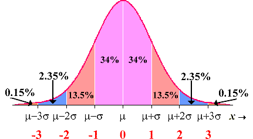

# Central Limit Theorem

## Introduction

In this lesson, we'll start to investigate a *central* statistical concept; the central limit theorem! (And how to write a good dry math pun.)

## Objectives
You will be able to:
* Demonstrate practical understanding of the Central Limit Theorem and how it can be used for parameter estimation

The central limit theorem states that under many conditions, independent random variables summed together will converge to a normal distribution as the number of variables increases. This becomes very useful for applying statistical logic to sample statistics in order to estimate population parameters. For example, as we saw in the previous lecture, the averages of samples will form a normal distribution. We can then use this information to put further bounds on our estimates of the population. We can also use this information to estimate the probability of samples taking on extreme values that deviate from the population mean.  

For example, lets say that we know the mean and standard deviation of asthma rates in the United States. If we then take a sample from a specific city and find that the mean of this sample is substantially lower then that of the overall population, we may be interested in questions such as what is the probability that this was just caused by random chance in sampling. If the probability is exceedingly low, we have further reason to believe that this city has higher rates of asthma and that its population is statistically different then that of the general population.  

The computation would be something like this: we know the mean population, and by the central limit theorem, the average of various samples takes on a normal distribution. From that normal distribution of sample means, we can then compare the mean of our actual sample and compare it to the distribution of means. It should be quite rare that our sample mean falls outside 2 or 3 standard deviations from the mean of sample means, (roughly 2.35% and .15% respectivley for each tail). As such, having a sample mean that falls outside of these scopes is worthy of further investigation.

As reference, here's is a rough empirical rule for percentiles within a normal distribution. (And again, by the central limit theorem, we expect our sample means to take on a normal distribution!)

## Additional Resources

http://sphweb.bumc.bu.edu/otlt/MPH-Modules/BS/BS704_Probability/BS704_Probability13.html

## Summary

In this brief lecture, we continued to discuss the central limit theorem and its application for sampling statistics and confidence intervals.
