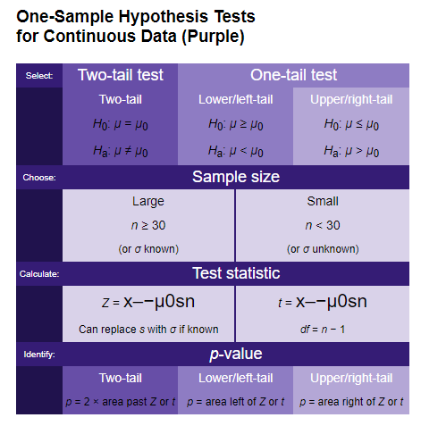
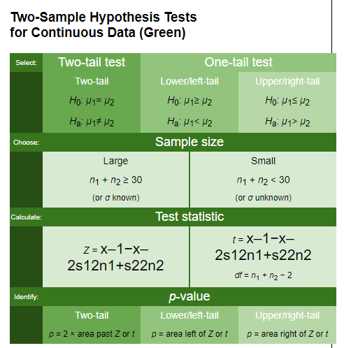
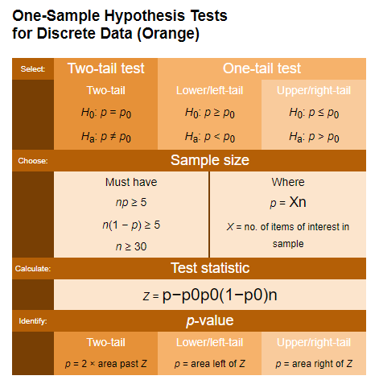
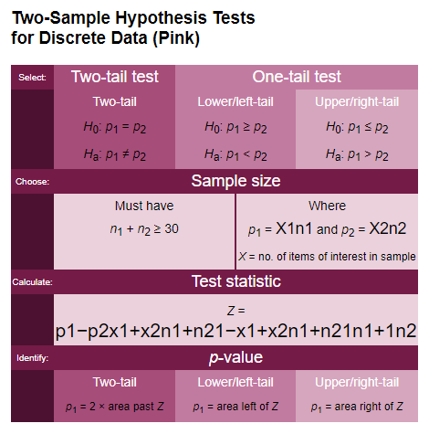

# P-Values and the Null Hypothesis

## Introduction

In this lesson, we'll learn about the relationship between P-values and the Null Hypothesis, and their role in designing an experiment. 

## Objectives

You will be able to:

* Understand and explain the null hypothesis, including its role in sound experiment design
* Understand, calculate, and interpret P-values

## Understanding  The Null Hypothesis

As we said previously, scientific experiments actually have 2 hypotheses:

**_Null Hypothesis_**: There is no relationship between A and B 
Example: "There is no relationship between this flu medication and a reduced recovery time from the flu".

The _Null Hypothesis_ is usually denoted as $H_O$

**_Alternative Hypothesis_**: The hypothesis we traditionally think of when thikning of a hypothesis for an experiment
Example: "This flu medication reduces recovery time for the flu."

The _Alternative Hypothesis_ is usually denoted as $H_a$

### P-Values and Alpha Values

No matter what you're experimenting on, good experiments come down down to one question: Is our p-value less than our alpha value? Let's dive into what each of these values represents, and why they're so important to experimental design. 

**_P-value_**: The calculated probability of arriving at this data randomly. 

If we calculate a p-value and it comes out to 0.03, we can interpret this as saying "There is a 3% chance that the results I'm seeing are actually due to randomness or pure luck".  

$\alpha$ **_(alpha value)_**: The marginal threshold at which we're okay with with rejecting the null hypothesis. 

An alpha value can be any value we set between 0 and 1. However, the most common alpha value in science is 0.05 (although this is somewhat of a controversial topic in the scientific community, currently).  

If we set an alpha value of $\alpha = 0.05$, we're essentially saying "I'm okay with accepting my alternative hypothesis as true if there is less than a 5% chance that the results that I'm seeing are actually due to randomness".  

When we conduct an experiment, our goal is calculate a p-value and compare it to our alpha value. If $p < \alpha$, then we **_reject the null hypothesis_** and accept that there is not "no relationship" between our dependent variables.  Note that any good scientist will admit that this doesn't prove that there is a _direct relationship_ between our dependent and independent variables--just that we have enough evidence to the contrary to show that we can no longer believe that there is no relationship between them. 

In simple terms:

$p < \alpha$: Reject the _Null Hypothesis_ and accept the _Alternative Hypothesis_

$p >= \alpha$: Fail to reject the _Null Hypothesis_.  

There are many different ways that we can structure a hypothesis statement, but they always come down to this comparison in the end.  In normally distributed data, we calculate p-values from z-scores. This is done a bit differently with discrete data. We may also have **_One-Tail_** and **_Two-Tail_** tests.  

A **_One-Tail Test_** is when we want to know if a parameter from our treatment group is greater than (or less than) a corresponding parameter from our control group.

**_Example One-Tail Hypothesis_**

"$H_a = \mu_1 < \mu_2 $ The treatment group given this weight loss drug will lost more weight on average than the control group that was given a competitor's weight loss drug 

$ H_o = \mu1 >= \mu_2$  The treatment group given this weight loss drug will not lose more weight on average than the control group that was given a competitor's weight loss drug". 

A **_Two-Tail Test_** is for when we want to test if a parameter falls between (or outside of) a range of two given values. 

**_Example Two-Tail Hypothesis_**

$H_a = \mu_1 != \mu_2$ "People in the experimental group that are administered this drug will not lose the same amount of weight as the people in the control group.  They will be heavier or lighter". 

$H_o = \mu_1 = \mu_2$ "People in the experimental group that are administered this drug will lose the same amount of weight as the people in the control group." 

## Use the Charts!

The following charts are designed to help you remember how to phrase, set up, and evaluate hypotheses for any experiment.  Note that before you can know which chart to use, you need to define if your experiment is with **_Continuous_** or **_Discrete_** data, and if your hypothesis test is a **_One-Tail_** or a **_Two-Tail_** test!

#### Charts for Continuous Data

|  |  |
|--------------------------------------------|--------------------------------------------|

#### Charts for Discrete Data

|  |  |
|--------------------------------------------|--------------------------------------------|

### Important Note

**_Do Not_** make the mistake of thinking you need to memorize each of the charts above.  Instead, focus on understanding the differences between them. You'll find each of the following charts stored as an image within the corresponding github repo for this lesson. 

**_Download these charts and store them on your machine for when you need them!_**

#### What Does an Experiment Really Prove?

You may be wondering why we need **_Null Hypothesis_** at all. This is a good question. It has to do with being honest about what an experiment actually proves.

Scientists use the **_Null Hypothesis_** so that we can be very specific in our findings. This is because a successful experiment doesn't actually _prove a relationship_ between our dependent and independent variable.  Instead, it just proves that we do not have enough evidence to convincingly believe there is _no relationship_ between the dependent and the independent variable. There can always be a lurking variable behind the scenes that is actually responsible for the relationship between our two variables--its almost impossible to cover every possible angle. However, a successful experiment where our p-value is less than our alpha value (typically, $p < 0.05$) does give us enough information to confidently say that's statistically unlikely that there is _no relationship_ between the two, which is what would have to be true in order for the null hypothesis to be correct!

## The Null Hypothesis Loves You and Wants You To Be Happy

We've covered a lot about the null hypothesis and how it's used in experiments in this lesson, but there's a lot more to learn about it! 

Read the following article, [The Null Hypothesis Loves You and Wants You To Be Happy](https://byrslf.co/the-null-hypothesis-loves-you-and-wants-you-to-be-happy-3189413d8cd0).  This does an excellent job of explaining why the concept of the _Null Hypothesis_ is crucial to good science.  

## Summary

In this lesson, you learned about the relationship between P-values and the Null Hypothesis. Now let's move on and see how group sizes affect our tests!
