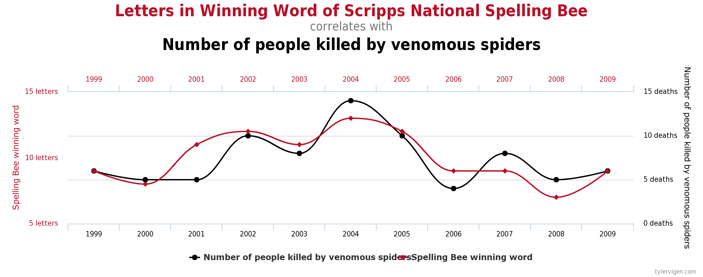
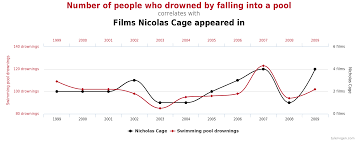
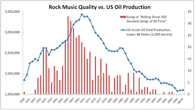

# Multiple Comparisons Problem

## Introduction

In this lesson, we'll learn about the problems that can arise from doing multiple comparisons in a single experiment.

## Objectives

You will be able to:

* Understand and explain the concept of spurious correlation
* Understand and explain why multiple comparisons increases the likelihood of misleading results
* Understand and use corrections such as the Bonferroni Correction to deal with multiple comparisons

## Spurious Correlation and Multiple Comparisons

By now, we've learned about the concept of correlation.  We've also learned some important adages, such as _"correlation does not equal causation"_.  Correlation tells us that there _seems_ to be some sort of mathematical relationship between the values of two different things.  If you're wondering why we say that there only _seems_ to be a mathematical relationship, because sometimes, two things that seem to be correlated aren't actually correlated--it just happens to look that way due to the random nature of our dataset. Although the data may suggest that two things are correlated, we know that there is no actual relationship between them.  We call these sorts of "false" correlations **_Spurious Correlation_**.

These are always fun--let's take a look at some examples!

### What is Spurious Correlation?

All of the data in the example graphs below are real. These are real spurious correlations that can be found in the real world.

#### Example 1

The number of letters in the winning word of the spelling bee correlates very closely with the number of people killed by venomous spiders that year. 

#### Example 2

The number of people who drown by falling in a pool each year correlates very closely with the number of films Nicolas Cage appears in each year.

#### Example 3

The number of songs from a given year that make the list of "Top 500 rock songs" by Rolling Stone correlates very closely with US Crude Oil Production. 

As we can see, although these graphs show that each of these things seems to be very strongly correlated, we know pretty intuitively just by looking at them that this must only be because of coincidence. Regardless of what the statistics tells us, there is no relationship through which the length of spelling bee word affects then number of people killed by venomous spiders

## How do Multiple Comparisons Increase the Chances of Finding Spurious Correlations?

Spurious correlation is a **_Type 1 Error_**, meaning that it's a type of **_False Positive_**. We think we've found something important, when really there isn't.  With each comparison we make in an experiment, we try to set a really low p-value to limit our exposure to type 1 errors.  When we only reject the null hypothesis when p < 0.05, for example, we are effectively saying "I'm only going to accept these results as true if there is less than a 5% chance that I didn't actually find anything important, and my data only looks like this due to randomness".  However, when we make **_Mulitple Comparisons_** by checking for many things at once, each of small risks of a Type 1 Error become cumulative! 

Here's another easy to way to phrase this--a p-value threshold of < .05 means that we will only make a Type 1 error 1 in every 20 times. This means that statistically, if I have 20 findings where my p-value is less than < .05 at the same time, 1 of them is almost guaranteed to be a Type 1 error (False Positive)--but I have no idea of which one!

## The Bonferroni Correction

The main way we can avoid the cumulative effect of Type 1 errors is through the use of statistical corrections such as the **_Bonferroni Correction_**.  To do this, we just divide our $\alpha$ value by the number of comparisons we are making to set a new, adjusted threshold rejecting the null hypothesis.

For instance, if we have $\alpha = 0.05$, and we are making 10 comparisons where we would normally reject the null hypothesis if $p < 0.05$, then we can use the Bonferroni Correction to set our adjusted p-value threshold to $\frac{0.05}{10} = 0.005$!  Now, with this much more strict p-value, we have controlled for Type 1 errors.  Note that this doesn't mean that we are immune to them--it just puts us back to the same level of risk of false positives of 0.05.

## Summary

In this lesson, you learned about the problems that can arise from doing multiple comparisons in a single experiment.
